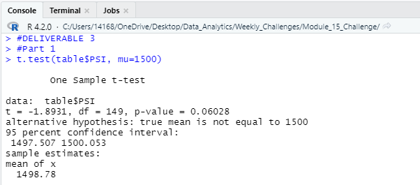
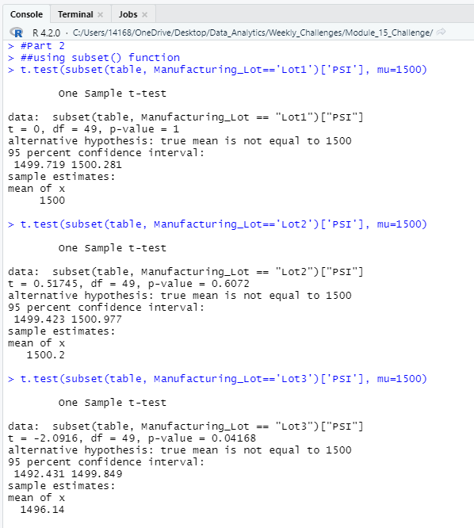

# MechaCar_Statistical_Analysis

## Deliverable 1 : Linear Regression to Predict MPG
In this deliverable, I created the Multiple Linear Regression that predicts the mpg of MechaCar prototypes using several variables.
and the result is showing in th console as below:

#### Which variables/coefficients provided a non-random amount of variance to the mpg values in the dataset?

According to our results, vehicle_length and ground_clearance provided non-random amounts of variance to the linear model. 
In other words the vehicle_length and ground_clearance have a significant impact on mpg. 

#### Is the slope of the linear model considered to be zero? Why or why not?
The p-value of our linear regression analysis is 5.35e-11 (0.0000000000535), which is much smaller than the common significance level of 0.05%, meaning that the null hypothesis can be rejected which means that the slope of our linear model is not zero.

#### Does this linear model predict mpg of MechaCar prototypes effectively? Why or why not?
the multiple R-squared value is 0.7149 which shows that it could be somewhat effective for predicting mpg.

## Deliverable 2 : Summary Statistics on Suspension Coils

In this deliverable, I wrote a piece of R code to read the Suspension_Coil.csv file into a table, then from that created a total summary dataframe containing Mean, Median, Variance and Standard Deviation of PSI across all vehicles.

*total_summary dataframe:*

Then I wrote another piece of R code to create a dataframe showing Mean, Median, Variance and Standard Deviation of PSI for each manufacturing lot.

*lot_summary dataframe:*

#### The design specifications for the MechaCar suspension coils dictate that the variance of the suspension coils must not exceed 100 pounds per square inch. Does the current manufacturing data meet this design specification for all manufacturing lots in total and each lot individually? Why or why not?

The variance of suspension coils for all manufacturing lots in total with variance of 62.29 and also manufacturing lot 1 with variance of 0.98 and lot 2 with variance of 7.47 individually are within the acceptable range, but the variance of the suspension coils for manufacturing lot 3 individually with variance of 170.28 exceeds the acceptable amount.

## Deliverable 3 : T-Tests on Suspension Coils
In this deliverable, I first did a T-test to determine if the PSI across all manufacturing lots is statistically different from the population mean of 1500 PSI. Results as shown:

The above result shows that with p-value of 0.06, which is higher than the common 0.05 percent, we do not have sufficient evidence to reject the null hypothesis.

Then I did the t-test for each individual manufacturing lot and got the results as below:

As we can see above:
for Lot 1, with the p-value being 1 which is higher than the common significance level (0.05), we would state that we do not have sufficient evidence to reject our null hypothesis, and therefore we fail to reject our null hypothesis. 

for Lot 2, the p-value is 0.6072 which is higher than 0.05, therefore we fail to reject our null hypothesis.

for Lot 3, the calculated p-value is 0.04 which is lower than 0.05, we would state that there is sufficient statistical evidence that our null hypothesis is not true, and therefore we would reject our null hypothesis.

## Deliverable 4 : Study Design: MechaCar vs Competition

- Write a short description of a statistical study that can quantify how the MechaCar performs against the competition. In your study design, think critically about what metrics would be of interest to a consumer: for a few examples, cost, city or highway fuel efficiency, horse power, maintenance cost, or safety rating.

In your description, address the following questions:

- What metric or metrics are you going to test?

- What is the null hypothesis or alternative hypothesis?

- What statistical test would you use to test the hypothesis? And why?

- What data is needed to run the statistical test?
HINT

