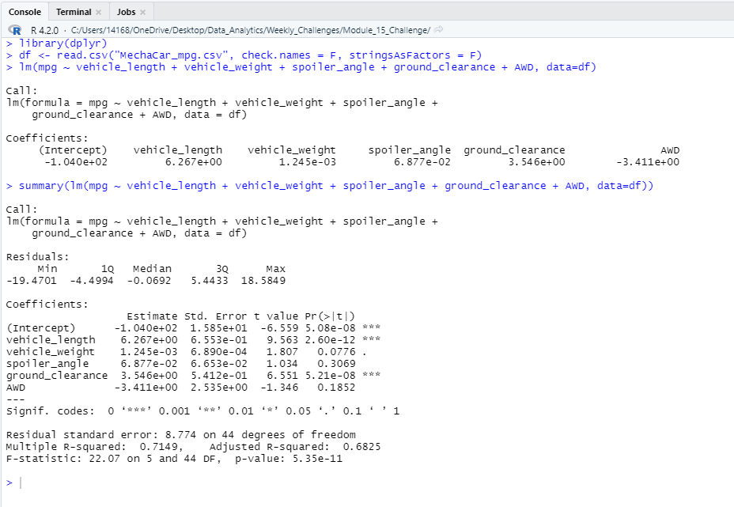
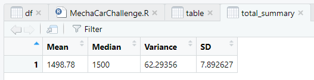
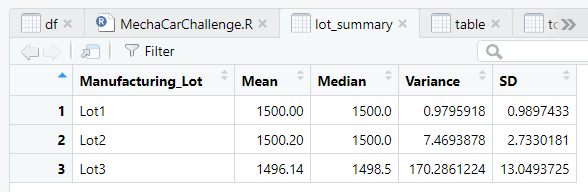

# MechaCar_Statistical_Analysis

## Deliverable 1 : Linear Regression to Predict MPG
In this deliverable, I created the Multiple Linear Regression that predicts the mpg of MechaCar prototypes using several variables.
and the result is showing in th console as below:

#### Which variables/coefficients provided a non-random amount of variance to the mpg values in the dataset?

According to our results, vehicle_length and ground_clearance provided non-random amounts of variance to the linear model. 
In other words the vehicle_length and ground_clearance have a significant impact on mpg. 

#### Is the slope of the linear model considered to be zero? Why or why not?

#### Does this linear model predict mpg of MechaCar prototypes effectively? Why or why not?
the R-squared value is 0.7149 

## Deliverable 2 : Summary Statistics on Suspension Coils

In this deliverable, I wrote a piece of R code to read the Suspension_Coil.csv file into a table, then from that created a total summary dataframe containing Mean, Median, Variance and Standard Deviation of PSI across all vehicles.

*total_summary dataframe:*

Then I wrote another piece of R code to create a dataframe showing Mean, Median, Variance and Standard Deviation of PSI for each manufacturing lot.

*lot_summary dataframe:*

#### The design specifications for the MechaCar suspension coils dictate that the variance of the suspension coils must not exceed 100 pounds per square inch. Does the current manufacturing data meet this design specification for all manufacturing lots in total and each lot individually? Why or why not?

The variance of suspension coils for all manufacturing lots in total with variance of 62.29 and also manufacturing lot 1 with variance of 0.98 and lot 2 with variance of 7.47 individually are within the acceptable range, but the variance of the suspension coils for manufacturing lot 3 individually with variance of 170.28 exceeds the acceptable amount.

## Deliverable 3

## Deliverable 4
